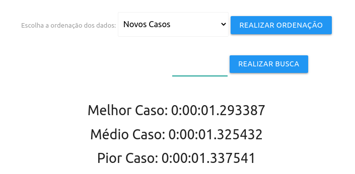
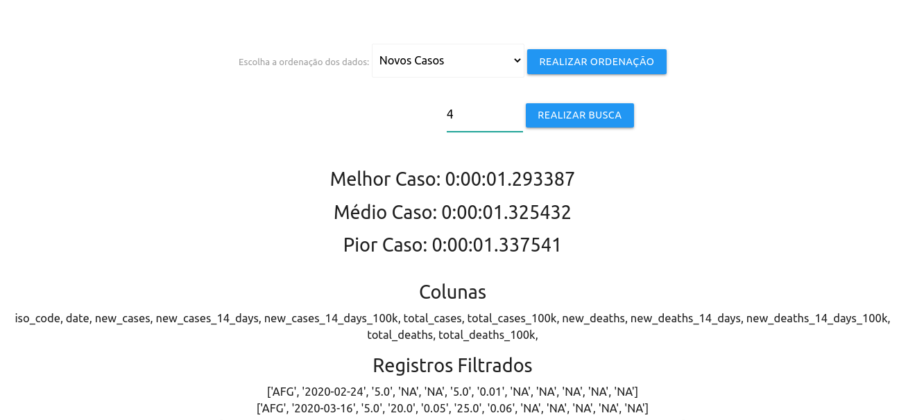

# aedIII-proj1
## Projeto De Algoritmos e Estrutura de Dados III
Objetivo do projeto é implementar 2 algoritmos(Busca/ordenação) em cima de uma base de dados grande.

Será utilizada neste projeto a base de dados fornecida pelo governo do canadá relacionado ao covid em escala global.

https://health-infobase.canada.ca/covid-19/international/
#Execução
python >= 3.7 and python <= 3.9

git clone https://github.com/Lucasbk2/aedIII-proj1.git

criar venv/ativar(python -m pip venv venv)

executar os seguintes comandos no diretorio acessado em 'covidinter/':

python manage.py migrate

python manage.py collectstatic

python manage.py runserver

##Projeto

Ao selecionar o tipo de ordenação e "Realizar Ordenação", o sistema irá organizar o vetor para a realização da busca, além disso, ele ira fazer 10 ordenações/buscas para determinar a velocidade do algortimo como na figura 2.

Figura 1

Figura 2

Melhor Caso: Melhor tempo de execução.

Médio Caso: Tempo de execução médio.

Pior Caso: Pior Tempo de execução.

Ao preencher o campo da busca e realiza-lá, o sistema irá realizar a busca do valor selecionado em cima dos dados que foram de ordenação selecionados.

Irá Retornar as colunas do arquivo csv junto com os dados ordenados por filtragem.

#Algortimo
Complexidade Big O(Merge Sort + Busca Linear) = O(n log n + n)

Algoritmo de ordenação(Merge Sort): 'covidinter/mainapp/views.py/realiza_ordenacao/mergesort'

Algoritmo de busca(Busca Linear): 'covidinter/mainapp/views.py/realiza_busca'

Algoritmo de cálculo de tempo: 'covidinter/mainapp/views.py/realiza_ordenacao/geraTemposExecucao'